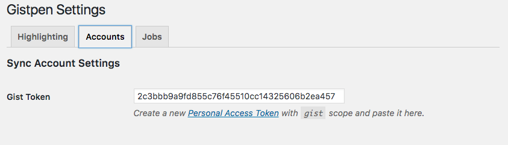
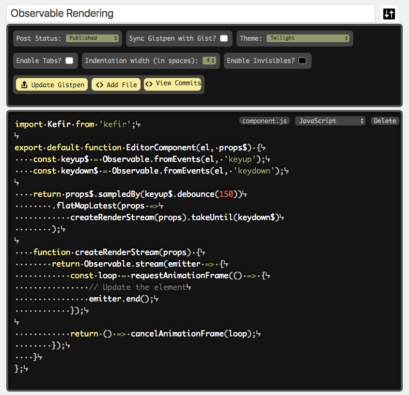

# WP-Gistpen: A Gist Clone for WordPress

[WP-Gistpen](https://wordpress.org/plugins/wp-gistpen/) is a WordPress plugin for saving and displaying code snippets on your WordPress site. I started this project because I believe in controlling your own data, even if it's something as simple as a code snippet. They say developers loathe a 1.0, and after three years of development, that rings more true than ever. But it's finally here, and I gotta say, it's pretty great.

I started building this plugin before Facebook was known for undermining democracy and enabling an invasion by foreign state actors, but even at the time, the sheer quantity of data they were collecting was concerning. Code snippets are one small area to reclaim your data, but I wanted to start building tools that make it as easy as possible to do that. For all its flaws, WordPress has an admirable dedication to user experience and ease-of-use, so it makes a solid platform for building these tools and making them widely accessible, and I learned a lot building WP-Gistpen.

Along those lines, I wanted to ensure your data is portable. WP-Gistpen can import & export your code snippets to GitHub's Gist. This makes for an easy migration into WP-Gistpen and give it a shot without locking you into the system. I wanted to make sure your data is portable, so all of the data related to the plugin is also exposed via API, including the snippets themselves as well as any plugin settings.

The editor screen leverages this same API, which integrates with the WP-API to enable a seamless editing experience. Each of the other screens in the WordPress admin are also API-driven, including the settings screen as well as a TinyMCE plugin for injecting shortcodes, which you can use to embed your code snippets into your posts. You can also embed them on other sites using WordPress' built-in oEmbed, which has been customized for WP-Gistpen code snippets.

WP-Gistpen uses the lightweight [Prism](https://github.com/PrismJS/prism/) by Lea Verou for syntax highlighting on the web-facing side. We also replace the default TinyMCE editor. I wanted harmony between the editing & display experience, so I built a custom editor on top of Prism. I'm in the process of moving it out of a custom view layer into React, open-sourcing it, and ironing out any remaining bugs.

If you're interested, you can check out [WP-Gistpen on wordpress.org](https://wordpress.org/plugins/wp-gistpen/) or [check out the source on GitHub](https://github.com/intraxia/wp-gistpen). Play around with it and file any issues you come across, and help make it better.

And if you're trying to decide what your next project should be, build something to host your own data. The future thanks you for it.
